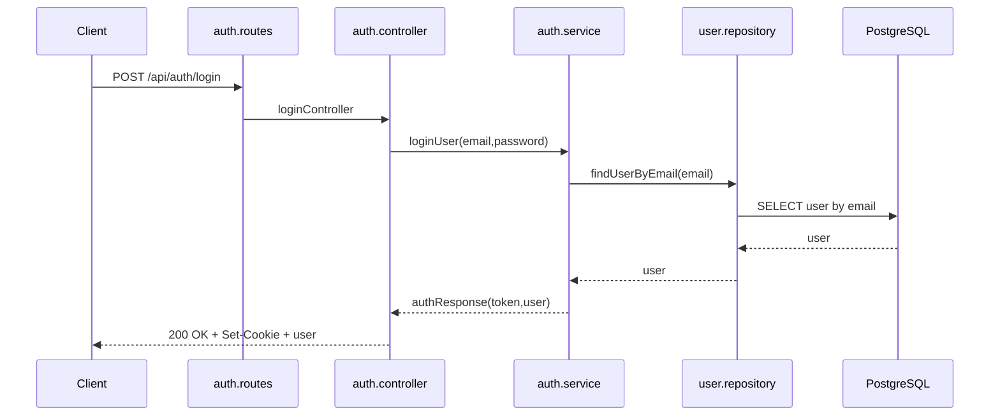
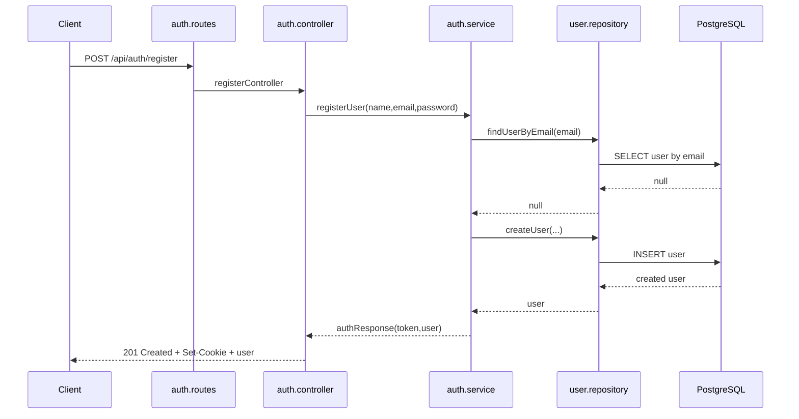
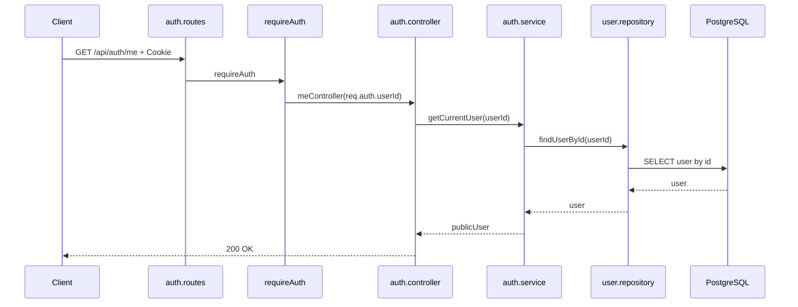

## Frontend Auth Redirect

- Login und Register duerfen einen `next`-Query-Parameter nutzen.
- `next` muss ein interner relativer Pfad sein, z. B. `/bookings/new?unitId=...`.
- Externe URLs, protocol-relative URLs wie `//example.com`, kaputte Werte und Auth-Loops werden auf `/` zurueckgefuehrt.
- Nach erfolgreichem Login/Register setzt das Backend ein `HttpOnly` Auth-Cookie und das Frontend navigiert zu `next`.
- Der eigentliche BookingFlow bleibt zusaetzlich auth-required und darf sich nicht nur auf diesen Redirect verlassen.

---

## Login Flow `POST /api/auth/login`

### Request

- Client sendet `POST /api/auth/login`
- Body enthält `email` und `password`

### Route

- Datei: [auth.routes.ts](../src/routes/auth.routes.ts)
- Mapping: `authRouter.post("/login", loginController)`

### Controller

- Datei: [auth.controller.ts](../src/controllers/auth.controller.ts)
- Funktion: `loginController`
- Aufgabe: Body mit `parseLoginBody(...)` prüfen, `loginUser(...)` aufrufen, Auth-Cookie setzen und Public User zurückgeben

### Service

- Datei: [auth.service.ts](../src/services/auth.service.ts)
- Funktion: `loginUser`
- Aufgabe: User per E-Mail laden, Passwort mit `bcrypt.compare(...)` prüfen, bei Erfolg `buildAuthResponse(...)`

### Repository

- Datei: [user.repository.ts](../src/db/user.repository.ts)
- Funktion: `findUserByEmail(email)`
- Aufgabe: User aus der DB per E-Mail holen

### Response

- Status: `200 OK`
- Cookie: `roomfull_access_token` als `HttpOnly`, `SameSite=Lax`, in Production `Secure`
- Body:
  - `user: { id, name, email, role, isDemo, demoExpiresAt, createdAt }`

### Mermaid (Happy Path)

### Error-Matrix

| Fehlerfall | HTTP |
|---|---|
| Body ungültig (`email/password`) | `400` |
| User fehlt oder Passwort falsch | `401` |

---

## Demo Login Flow `POST /api/auth/demo-login`

### Request

- Client sendet `POST /api/auth/demo-login`
- Kein Body erforderlich

### Route

- Datei: [auth.routes.ts](../src/routes/auth.routes.ts)
- Mapping: `authRouter.post("/demo-login", demoLoginController)`

### Controller

- Datei: [auth.controller.ts](../src/controllers/auth.controller.ts)
- Funktion: `demoLoginController`
- Aufgabe: `createDemoCustomerSession(...)` aufrufen, Auth-Cookie setzen und Public User zurückgeben

### Service

- Datei: [auth.service.ts](../src/services/auth.service.ts)
- Funktion: `createDemoCustomerSession`
- Aufgabe: frischen Demo Customer mit `role=CUSTOMER`, `isDemo=true` und `demoExpiresAt` erzeugen, Demo Customer Data Template anstoßen, dann interne Session und Response bauen
- Demo-Daten-Service: [demo-customer-data.service.ts](../src/services/demo-customer-data.service.ts)
- Aktueller Template-Stand: eine zukünftige aktive Booking, eine vergangene aktive Booking, eine stornierte Booking, eine Customer Contact Request und drei Customer Teams mit je zwei Team Members; bei Booking-Konflikten werden weitere Werktage/Units versucht

### Repository

- Datei: [user.repository.ts](../src/db/user.repository.ts)
- Funktion: `createUser(input)`
- Aufgabe: Demo Customer in der DB schreiben

### Response

- Status: `201 Created`
- Cookie: `roomfull_access_token` als `HttpOnly`, `SameSite=Lax`, in Production `Secure`
- Body:
  - `user: { id, name, email, role, isDemo, demoExpiresAt, createdAt }`

### Scope

- Der Endpoint erzeugt erste vorbefüllte Demo-Daten im Scope des neuen Demo Customers.
- Der Endpoint führt keine neue Rolle ein. Demo Customers bleiben normale Customers mit Demo-Markierung.
- Demo Customers dürfen normale Customer-Workflows nutzen, aber keine Account-Identitäts- oder Sicherheitsdaten ändern.
- Künftige Account-Mutation-Endpunkte für Name, E-Mail, Passwort, Credential-Status, Account-Löschung oder Umwandlung in einen regulären Account müssen `isDemo=true` im Service-Layer vor Persistenz mit `403 Forbidden` ablehnen.

### Cleanup

- Abgelaufene Demo Customers werden nicht über einen öffentlichen API-Endpunkt bereinigt.
- Manuelles Kommando: `npm run demo:cleanup` im `backend`-Verzeichnis.
- Der Cleanup löscht ausschließlich User mit `isDemo=true` und `demoExpiresAt < now`.
- Vor der User-Löschung entfernt der Cleanup abhängige Bookings, Contact Requests, Team Members und Teams im selben Transaktionsrahmen.
- Die finale User-Löschung enthält erneut die Demo- und Expiry-Grenze, damit reguläre Customers nicht durch den Cleanup betroffen sind.

---

## Register Flow `POST /api/auth/register`

### Request

- Client sendet `POST /api/auth/register`
- Body enthält `name`, `email` und `password`

### Route

- Datei: [auth.routes.ts](../src/routes/auth.routes.ts)
- Mapping: `authRouter.post("/register", registerController)`

### Controller

- Datei: [auth.controller.ts](../src/controllers/auth.controller.ts)
- Funktion: `registerController`
- Aufgabe: Body mit `parseRegisterBody(...)` prüfen, `registerUser(...)` aufrufen, Auth-Cookie setzen und Public User zurückgeben

### Service

- Datei: [auth.service.ts](../src/services/auth.service.ts)
- Funktion: `registerUser`
- Aufgabe: E-Mail per `findUserByEmail(...)` prüfen, Passwort mit `bcrypt.hash(...)` hashen, User anlegen, dann interne Session und Response bauen

### Repository

- Datei: [user.repository.ts](../src/db/user.repository.ts)
- Funktionen: `findUserByEmail(email)` und `createUser(input)`
- Aufgabe: Vorhandenen User prüfen und neuen User in die DB schreiben

### Response

- Status: `201 Created`
- Cookie: `roomfull_access_token` als `HttpOnly`, `SameSite=Lax`, in Production `Secure`
- Body:
  - `user: { id, name, email, role, isDemo, demoExpiresAt, createdAt }`

### Mermaid (Happy Path)

### Error-Matrix

| Fehlerfall | HTTP |
|---|---|
| Body ungültig (`name/email/password`) | `400` |
| E-Mail bereits vergeben | `409` |

---

## Me Flow `GET /api/auth/me`

### Request

- Client sendet `GET /api/auth/me`
- Request enthält das `roomfull_access_token` Cookie

### Route

- Datei: [auth.routes.ts](../src/routes/auth.routes.ts)
- Mapping: `authRouter.get("/me", requireAuth, meController)`

### Middleware

- Datei: [auth.middleware.ts](../src/middleware/auth.middleware.ts)
- Funktion: `requireAuth`
- Aufgabe: Auth-Cookie prüfen, JWT verifizieren, `req.auth` setzen

### Controller

- Datei: [auth.controller.ts](../src/controllers/auth.controller.ts)
- Funktion: `meController`
- Aufgabe: `req.auth.userId` lesen und `getCurrentUser(...)` aufrufen

### Service

- Datei: [auth.service.ts](../src/services/auth.service.ts)
- Funktion: `getCurrentUser`
- Aufgabe: User per ID laden und als Public-User zurückgeben

### Repository

- Datei: [user.repository.ts](../src/db/user.repository.ts)
- Funktion: `findUserById(id)`
- Aufgabe: User aus der DB per ID holen

### Response

- Status: `200 OK`
- Body:
  - `user: { id, name, email, role, isDemo, demoExpiresAt, createdAt }`

### Mermaid (Happy Path)

### Error-Matrix

| Fehlerfall | HTTP |
|---|---|
| Auth-Cookie fehlt/ungültig | `401` |
| User nicht gefunden | `404` |

---

## Logout Flow `POST /api/auth/logout`

### Request

- Client sendet `POST /api/auth/logout`
- Request darf das `roomfull_access_token` Cookie enthalten

### Route

- Datei: [auth.routes.ts](../src/routes/auth.routes.ts)
- Mapping: `authRouter.post("/logout", logoutController)`

### Controller

- Datei: [auth.controller.ts](../src/controllers/auth.controller.ts)
- Funktion: `logoutController`
- Aufgabe: Auth-Cookie löschen

### Response

- Status: `204 No Content`
- Cookie: `roomfull_access_token` wird gelöscht
