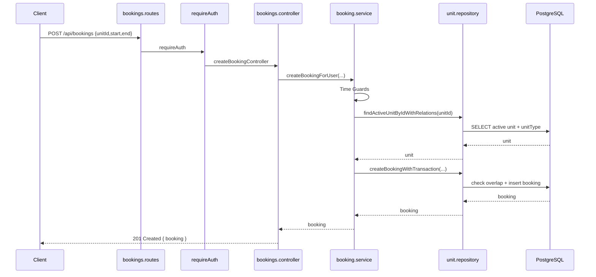
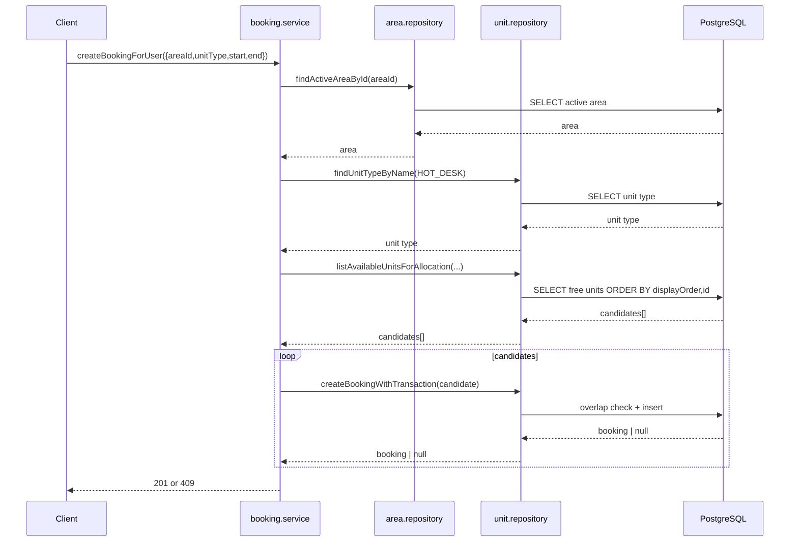
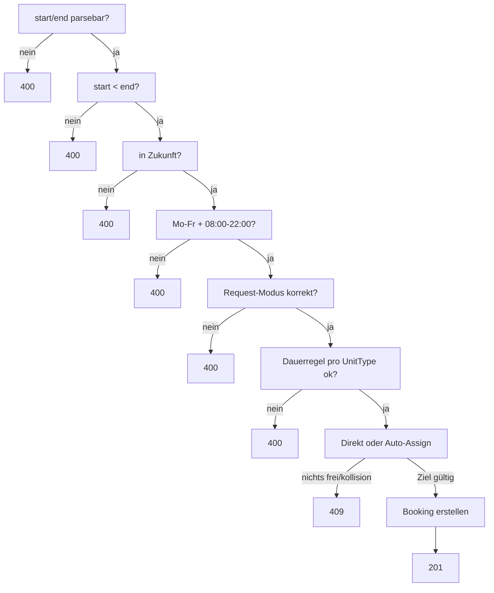
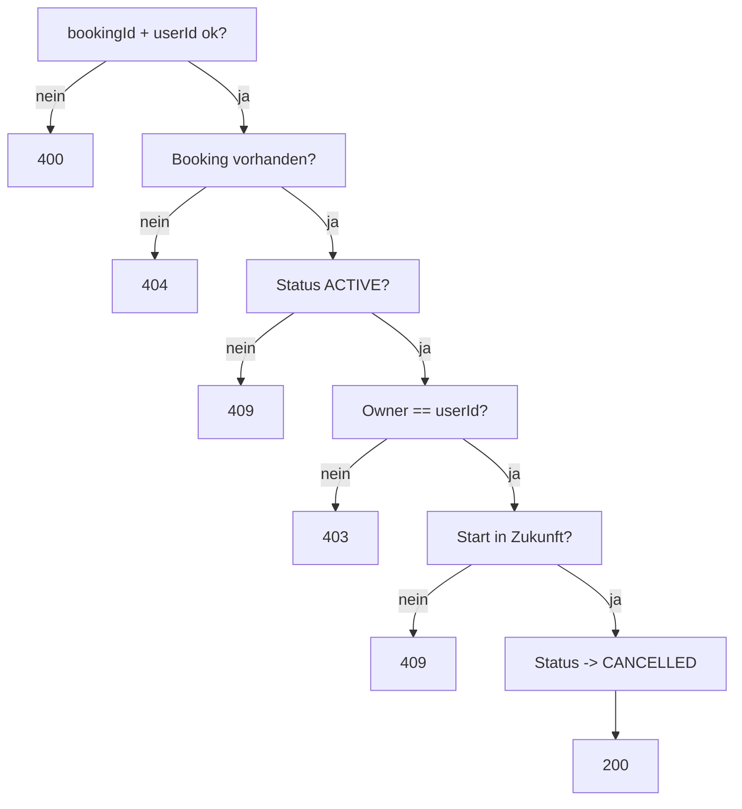

## Customer Create Booking Flow `POST /api/bookings`

### Request

- Client sendet `POST /api/bookings`
- Header enthält `Authorization: Bearer <token>`
- Body nutzt einen von zwei Modi:
  - direkt: `unitId + start + end`
  - auto-assign: `areaId + unitType + start + end` (in V1 nur `HOT_DESK`)

### Route

- Datei: [bookings.routes.ts](../src/routes/bookings.routes.ts)
- Mapping:
  - `bookingsRouter.use(requireAuth)`
  - `bookingsRouter.route("/bookings").post(createBookingController)`

### Controller

- Datei: [bookings.controller.ts](../src/controllers/bookings.controller.ts)
- Funktion: `createBookingController`
- Aufgabe: Auth-User prüfen, Body prüfen, Service aufrufen

### Service

- Datei: [booking.service.ts](../src/services/booking.service.ts)
- Funktion: `createBookingForUser`
- Aufgabe:
  - Zeitvalidierung (`start < end`, Zukunft, Mo-Fr, `08:00-22:00`)
  - Modus auflösen (direkt vs auto-assign)
  - Dauerregel aus UnitType-Policy prüfen
  - Overlap-freie Booking erstellen

### Repository

- Dateien:
  - [unit.repository.ts](../src/db/unit.repository.ts)
  - [booking.repository.ts](../src/db/booking.repository.ts)
- Funktionen:
  - `findActiveUnitByIdWithRelations`
  - `findActiveAreaById`
  - `findUnitTypeByName`
  - `listAvailableUnitsForAllocation`
  - `createBookingWithTransaction`

### Overlap-Regel

Eine Kollision liegt vor, wenn:

```txt
new_start < existing_end
AND
new_end > existing_start
```

### Mermaid (Happy Path, Direct)



### Mermaid (Happy Path, Auto Assign HOT_DESK)



### Guard-Flow (Create)



### Error-Matrix

| Fehlerfall | HTTP |
|---|---|
| Body ungültig / Zeitvalidierung fehlgeschlagen | `400` |
| Nicht eingeloggt | `401` |
| Unit/Area/UnitType nicht gefunden | `404` |
| Overlap / kein freier Hot Desk | `409` |

---

## Customer My Bookings Flow `GET /api/me/bookings`

### Request

- Client sendet `GET /api/me/bookings`
- Header enthält `Authorization: Bearer <token>`

### Route

- Datei: [bookings.routes.ts](../src/routes/bookings.routes.ts)
- Mapping: `bookingsRouter.route("/me/bookings").get(listMyBookingsController)`

### Controller

- Datei: [bookings.controller.ts](../src/controllers/bookings.controller.ts)
- Funktion: `listMyBookingsController`
- Aufgabe: Auth-User prüfen, Service aufrufen

### Service

- Datei: [booking.service.ts](../src/services/booking.service.ts)
- Funktion: `listUserBookings`

### Repository

- Datei: [booking.repository.ts](../src/db/booking.repository.ts)
- Funktion: `listUserBookings`

---

## Customer Cancel Booking Flow `DELETE /api/bookings/:bookingId`

### Request

- Client sendet `DELETE /api/bookings/:bookingId`
- Header enthält `Authorization: Bearer <token>`

### Route

- Datei: [bookings.routes.ts](../src/routes/bookings.routes.ts)
- Mapping: `bookingsRouter.route("/bookings/:bookingId").delete(cancelBookingController)`

### Service-Regel

`cancelBookingForUser` prüft:

- Booking existiert
- Booking ist `ACTIVE`
- Booking gehört dem User
- Booking liegt in der Zukunft

Dann Statuswechsel auf `CANCELLED`.

### Mermaid (Cancel-Regel kompakt)



### Error-Matrix

| Fehlerfall | HTTP |
|---|---|
| Ungültiger `bookingId`-Parameter | `400` |
| Nicht eingeloggt | `401` |
| Buchung gehört anderem User | `403` |
| Buchung nicht gefunden | `404` |
| Bereits storniert oder nicht mehr zukünftig | `409` |

---

## Admin List Bookings Flow `GET /api/admin/bookings`

### Request

- Client sendet `GET /api/admin/bookings`
- Header enthält `Authorization: Bearer <adminToken>`

### Route

- Datei: [bookings.routes.ts](../src/routes/bookings.routes.ts)
- Mapping: `bookingsRouter.route("/admin/bookings").get(requireRole("ADMIN"), listAdminBookingsController)`

### Middleware

- `requireAuth` (router-level)
- `requireRole("ADMIN")` (route-level)

### Service

- Datei: [booking.service.ts](../src/services/booking.service.ts)
- Funktion: `listAllBookingsForAdmin`

### Error-Matrix

| Fehlerfall | HTTP |
|---|---|
| Kein/ungültiger Token | `401` |
| Rolle nicht `ADMIN` | `403` |
