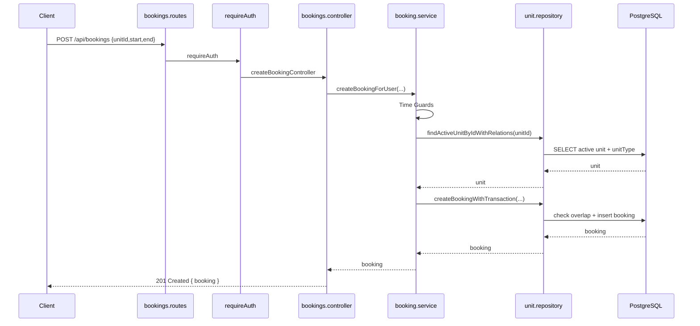
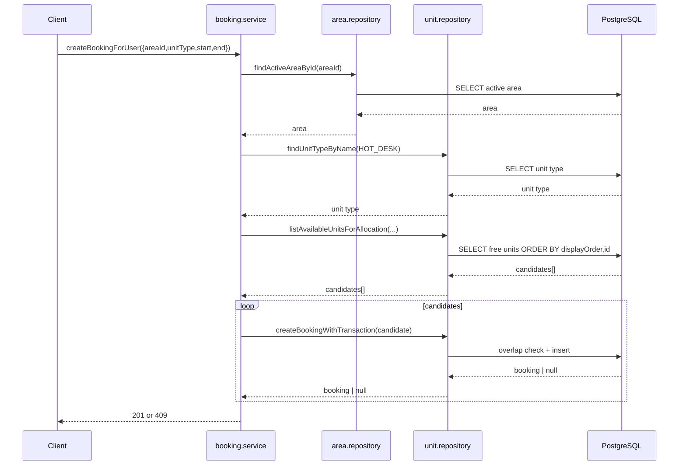
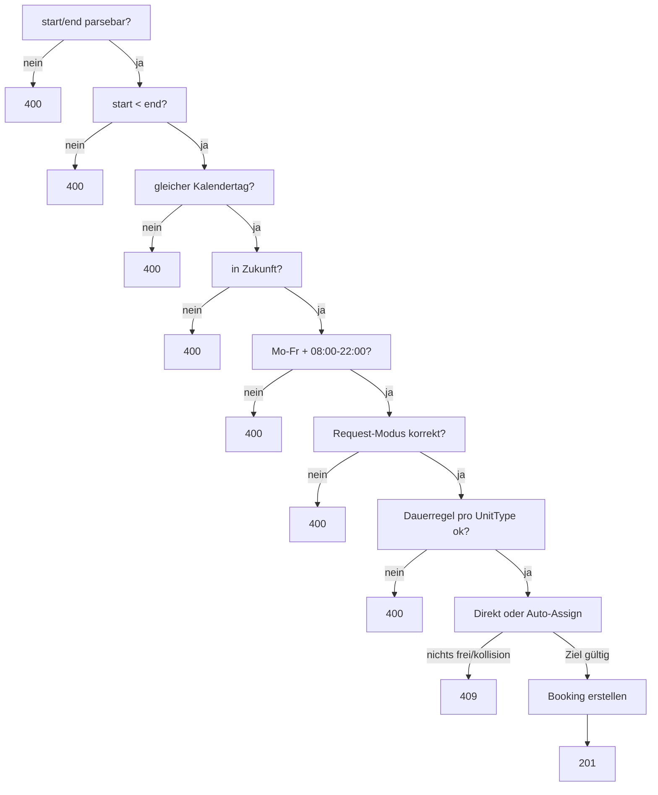
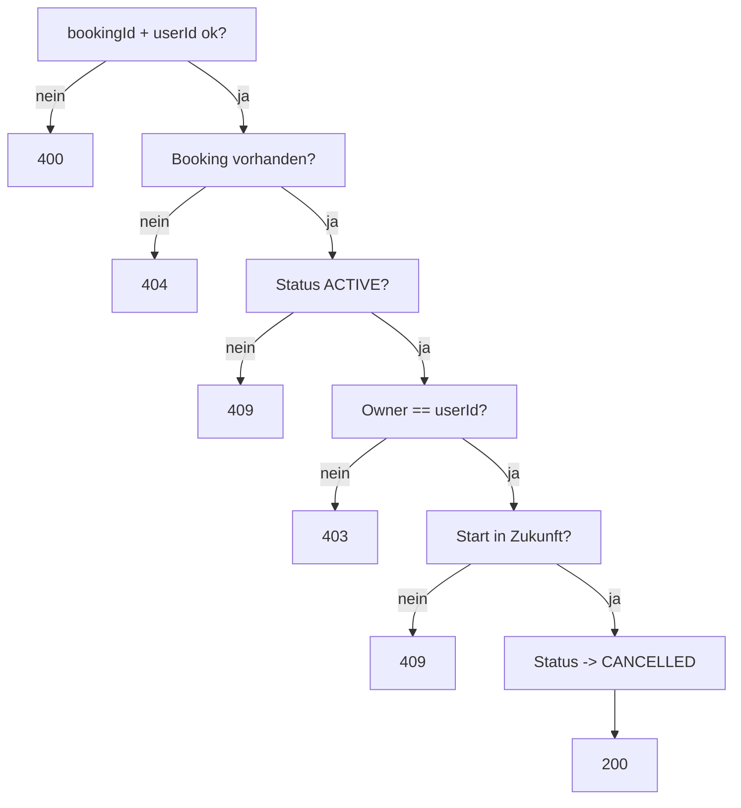

## Customer BookingFlow Entscheidungen

Diese Entscheidungen beschreiben das Zielbild fuer den Customer-BookingFlow. Einzelne technische Slices werden danach separat umgesetzt.

### Einstieg und Angebotsauswahl

- Homepage zeigt `BookingOption`s, nicht einzelne Units.
- BookingOptions verlinken auf oeffentliche Angebotsuebersichten:
  - `/booking-options/hot-desk`
  - `/booking-options/booth`
  - `/booking-options/team-room`
  - `/booking-options/meeting-room`
- Angebotsuebersichten sind public und enthalten noch keine zeitbezogene Verfuegbarkeit.
- Gueltiger UnitType ohne aktive Angebote zeigt einen Empty State.
- Ungueltiger Slug/UnitType fuehrt zu `404`.

### Auswahlmodell je UnitType

- `HOT_DESK`: User waehlt eine Area, z. B. `Open World` oder `Quiet Place`.
- `HOT_DESK`: User sieht und waehlt keinen konkreten Einzelplatz.
- `HOT_DESK`: Backend weist per Auto-Assign eine freie konkrete Unit zu.
- `BOOTH`, `TEAM_ROOM`, `MEETING_ROOM`: User waehlt eine konkrete Unit.
- Areas sind im Customer-Flow ausschliesslich fuer `HOT_DESK` relevant.

### Auth-Gate und Routen

- Angebotsuebersicht bleibt public.
- Eigentliche Buchung ist auth-required.
- Auth-Gate kommt bei "Angebot buchen", nicht schon beim Homepage-Klick.
- Login und Register sollen einen sicheren internen `next`-Parameter nutzen.
- Frontend-Routen `/login` und `/register` bereinigen `next` vor dem Redirect.
- Gemeinsamer BookingFlow:
  - `/bookings/new?unitId=...`
  - `/bookings/new?unitType=HOT_DESK&areaId=...`
- `/bookings/new` ohne gueltigen Kontext wird nicht als sinnvoller Einstieg behandelt.

### Zeit- und Verfuegbarkeitsmodell

- User waehlt konkrete Von-bis-Zeitraeume.
- UI nutzt ein 30-Minuten-Raster als Auswahlhilfe, kein fachlich gespeichertes Slot-Modell.
- User waehlt Datum, dann Startzeit, dann eine erlaubte Endzeit.
- Startzeiten orientieren sich an den globalen Oeffnungszeiten `08:00-22:00`.
- Endzeiten werden aus Startzeit, UnitType-Dauerregel, Oeffnungsende und bei Direct Mode aus blockierenden Intervallen gefiltert.
- Fachliche Coworking-Zeit ist `Europe/Berlin`.
- Backend-Zeitvalidierung laeuft zentral ueber `booking-time-policy.ts`.
- Backend bleibt Source of Truth fuer Zeitregeln und Konflikte.
- Bookings starten und enden am selben Kalendertag.
- Kein Hold/5-Minuten-Timer im MVP.
- Race-Conflicts werden ueber `409 Conflict` behandelt.

### Tagesbelegung fuer konkrete Units

- Fuer `BOOTH`, `TEAM_ROOM` und `MEETING_ROOM` soll der BookingFlow nach Datumsauswahl belegte Intervalle anzeigen.
- Die UI zeigt bei Direct Mode alle Rasterpunkte und markiert belegte Zeiten sichtbar als blockiert.
- Tagesbelegung ist auth-required.
- Endpoint: `GET /units/:unitId/day-bookings?date=YYYY-MM-DD`
- Response enthaelt nur aktive blockierende Intervalle, keine Owner-/User-Daten.
- Vergangene Tage und Wochenenden sind fuer diesen Flow ungueltig.
- `HOT_DESK` bekommt im MVP keine Area-Availability-Preview; Verfuegbarkeit wird beim Submit final per Auto-Assign geprueft.

### Abschluss und Fehlerverhalten

- Erfolgreiche Buchung fuehrt zu `Meine Buchungen` mit Success-Hinweis.
- Bestehende Buchungen koennen im MVP nicht geaendert werden.
- Aenderung bedeutet: stornieren und neu buchen.
- Storno ist nur fuer eigene zukuenftige Buchungen erlaubt.
- `400`: Eingaben korrigieren.
- `401`: Login mit `next`.
- `404`: Unit/Area nicht mehr verfuegbar, zur Angebotsuebersicht zurueck.
- `409`: Zeitraum inzwischen belegt, im Flow bleiben und neu waehlen.
- Netzwerkfehler: Retry anbieten.

### Dauerregeln Zielbild

- `HOT_DESK`: min 30, max 240 Minuten
- `BOOTH`: min 60, max 240 Minuten
- `TEAM_ROOM`: min 60, max 480 Minuten
- `MEETING_ROOM`: min 60, max 480 Minuten
- Public Contracts liefern diese Werte ueber `unitType.minDurationMinutes` und `unitType.maxDurationMinutes`.

---

## Customer Booking Context Flow `GET /api/bookings/context`

### Request

- Client sendet `GET /api/bookings/context`
- Header enthält `Authorization: Bearer <token>`
- Query nutzt genau einen von zwei Einstiegskontexten:
  - direkt: `unitId=...`
  - auto-assign: `unitType=HOT_DESK&areaId=...`

### Ziel

- Backend validiert den Entry Context fuer `/bookings/new`.
- Response liefert Anzeige- und Dauerregel-Kontext.
- Response liefert keine zeitbezogene Verfuegbarkeit.
- Hot Desk liefert keine konkrete Unit, sondern Area-Kontext und `seatCount`.

### Route

- Datei: [bookings.routes.ts](../src/routes/bookings.routes.ts)
- Mapping:
  - `bookingsRouter.use(requireAuth)`
  - `bookingsRouter.route("/bookings/context").get(getBookingContextController)`

### Controller

- Datei: [bookings.controller.ts](../src/controllers/bookings.controller.ts)
- Funktion: `getBookingContextController`
- Aufgabe: Auth-User pruefen, Query technisch parsen, Service aufrufen

### Service

- Datei: [booking.service.ts](../src/services/booking.service.ts)
- Funktion: `getBookingContext`
- Aufgabe:
  - Entry Context aufloesen
  - `DIRECT` ueber aktive Unit + UnitType-Policy bauen
  - `AUTO_ASSIGN` nur fuer `HOT_DESK` erlauben
  - aktive Area + Hot-Desk-SeatCount + UnitType-Policy bauen

### Response

```txt
200 { bookingContext }
```

Modi:

- `DIRECT`: konkrete Unit mit `id`, `name`, `description`, `capacity`, `unitType`
- `AUTO_ASSIGN`: `unitType` + `area` mit `id`, `name`, `description`, `seatCount`

### Error-Matrix

| Fehlerfall | HTTP |
|---|---|
| Ungueltiger oder gemischter Query-Kontext | `400` |
| Nicht eingeloggt | `401` |
| Unit/Area/UnitType nicht gefunden oder nicht buchbar | `404` |

`409` wird hier nicht verwendet, weil ohne Datum/Zeitfenster kein Buchungskonflikt bewertet wird.

---

## Customer Create Booking Flow `POST /api/bookings`

### Request

- Client sendet `POST /api/bookings`
- Header enthält `Authorization: Bearer <token>`
- Body nutzt einen von zwei Modi:
  - direkt: `unitId + start + end`
  - auto-assign: `areaId + unitType + start + end` (in V1 nur `HOT_DESK`)

### Route

- Datei: [bookings.routes.ts](../src/routes/bookings.routes.ts)
- Mapping:
  - `bookingsRouter.use(requireAuth)`
  - `bookingsRouter.route("/bookings").post(createBookingController)`

### Controller

- Datei: [bookings.controller.ts](../src/controllers/bookings.controller.ts)
- Funktion: `createBookingController`
- Aufgabe: Auth-User prüfen, Body prüfen, Service aufrufen

### Service

- Datei: [booking.service.ts](../src/services/booking.service.ts)
- Funktion: `createBookingForUser`
- Aufgabe:
  - Zeitvalidierung (`start < end`, gleicher Kalendertag, Zukunft, Mo-Fr, `08:00-22:00`)
  - Modus auflösen (direkt vs auto-assign)
  - Dauerregel aus UnitType-Policy prüfen
  - Overlap-freie Booking erstellen

### Repository

- Dateien:
  - [unit.repository.ts](../src/db/unit.repository.ts)
  - [booking.repository.ts](../src/db/booking.repository.ts)
- Funktionen:
  - `findActiveUnitByIdWithRelations`
  - `findActiveAreaById`
  - `findUnitTypeByName`
  - `listAvailableUnitsForAllocation`
  - `createBookingWithTransaction`

### Overlap-Regel

Eine Kollision liegt vor, wenn:

```txt
new_start < existing_end
AND
new_end > existing_start
```

### Mermaid (Happy Path, Direct)



### Mermaid (Happy Path, Auto Assign HOT_DESK)



### Guard-Flow (Create)



### Error-Matrix

| Fehlerfall | HTTP |
|---|---|
| Body ungültig / Zeitvalidierung fehlgeschlagen | `400` |
| Nicht eingeloggt | `401` |
| Unit/Area/UnitType nicht gefunden | `404` |
| Overlap / kein freier Hot Desk | `409` |

---

## Customer My Bookings Flow `GET /api/me/bookings`

### Request

- Client sendet `GET /api/me/bookings`
- Header enthält `Authorization: Bearer <token>`

### Route

- Datei: [bookings.routes.ts](../src/routes/bookings.routes.ts)
- Mapping: `bookingsRouter.route("/me/bookings").get(listMyBookingsController)`

### Controller

- Datei: [bookings.controller.ts](../src/controllers/bookings.controller.ts)
- Funktion: `listMyBookingsController`
- Aufgabe: Auth-User prüfen, Service aufrufen

### Service

- Datei: [booking.service.ts](../src/services/booking.service.ts)
- Funktion: `listUserBookings`

### Repository

- Datei: [booking.repository.ts](../src/db/booking.repository.ts)
- Funktion: `listUserBookings`

---

## Customer Cancel Booking Flow `DELETE /api/bookings/:bookingId`

### Request

- Client sendet `DELETE /api/bookings/:bookingId`
- Header enthält `Authorization: Bearer <token>`

### Route

- Datei: [bookings.routes.ts](../src/routes/bookings.routes.ts)
- Mapping: `bookingsRouter.route("/bookings/:bookingId").delete(cancelBookingController)`

### Service-Regel

`cancelBookingForUser` prüft:

- Booking existiert
- Booking ist `ACTIVE`
- Booking gehört dem User
- Booking liegt in der Zukunft

Dann Statuswechsel auf `CANCELLED`.

### Mermaid (Cancel-Regel kompakt)



### Error-Matrix

| Fehlerfall | HTTP |
|---|---|
| Ungültiger `bookingId`-Parameter | `400` |
| Nicht eingeloggt | `401` |
| Buchung gehört anderem User | `403` |
| Buchung nicht gefunden | `404` |
| Bereits storniert oder nicht mehr zukünftig | `409` |

---

## Admin List Bookings Flow `GET /api/admin/bookings`

### Request

- Client sendet `GET /api/admin/bookings`
- Header enthält `Authorization: Bearer <adminToken>`

### Route

- Datei: [bookings.routes.ts](../src/routes/bookings.routes.ts)
- Mapping: `bookingsRouter.route("/admin/bookings").get(requireRole("ADMIN"), listAdminBookingsController)`

### Middleware

- `requireAuth` (router-level)
- `requireRole("ADMIN")` (route-level)

### Service

- Datei: [booking.service.ts](../src/services/booking.service.ts)
- Funktion: `listAllBookingsForAdmin`

### Error-Matrix

| Fehlerfall | HTTP |
|---|---|
| Kein/ungültiger Token | `401` |
| Rolle nicht `ADMIN` | `403` |
