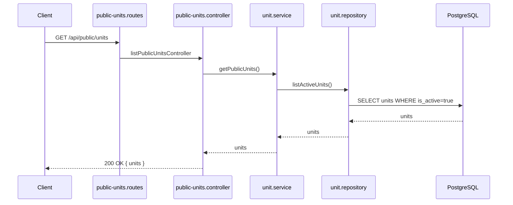
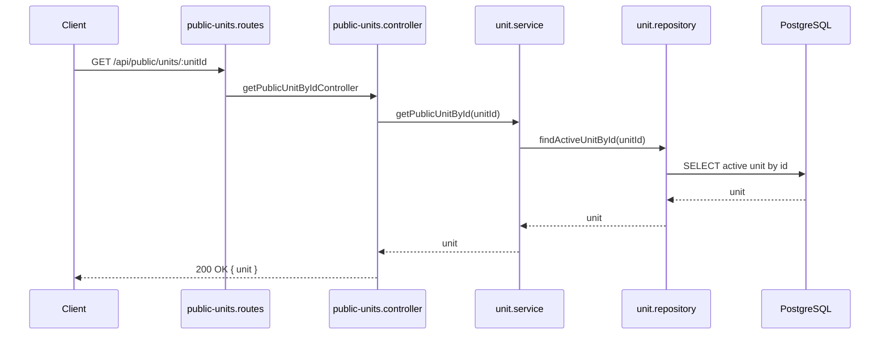
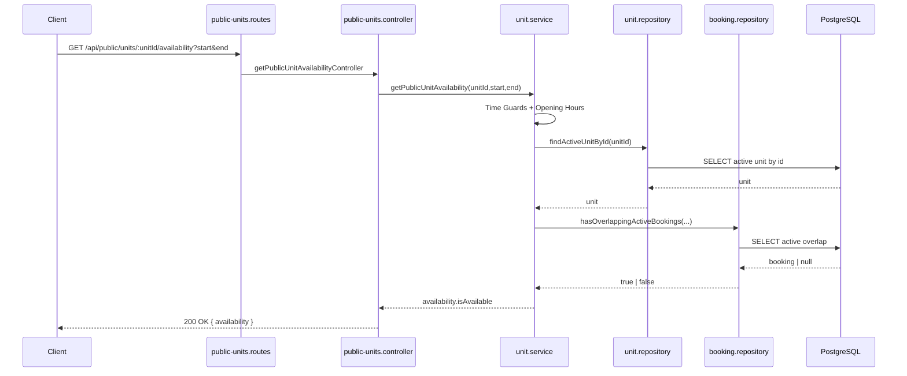

## Public Units List Flow `GET /api/public/units`

### Request

- Client sendet `GET /api/public/units`

### Route

- Datei: [public-units.routes.ts](../src/routes/public-units.routes.ts)
- Mapping: `publicUnitsRouter.route("/units").get(listPublicUnitsController)`

### Controller

- Datei: [public-units.controller.ts](../src/controllers/public-units.controller.ts)
- Funktion: `listPublicUnitsController`
- Aufgabe: `getPublicUnits(...)` aufrufen und Ergebnis als `{ units }` zurückgeben

### Service

- Datei: [unit.service.ts](../src/services/unit.service.ts)
- Funktion: `getPublicUnits`
- Aufgabe: nur aktive Units laden lassen

### Repository

- Datei: [unit.repository.ts](../src/db/unit.repository.ts)
- Funktion: `listActiveUnits`
- Aufgabe: DB-Query mit `where: { isActive: true }`

### Mermaid (Happy Path)



---

## Public Unit Detail Flow `GET /api/public/units/:unitId`

### Request

- Client sendet `GET /api/public/units/:unitId`

### Route

- Datei: [public-units.routes.ts](../src/routes/public-units.routes.ts)
- Mapping: `publicUnitsRouter.route("/units/:unitId").get(getPublicUnitByIdController)`

### Controller

- Datei: [public-units.controller.ts](../src/controllers/public-units.controller.ts)
- Funktion: `getPublicUnitByIdController`
- Aufgabe: `unitId` prüfen, `getPublicUnitById(...)` aufrufen, Ergebnis als `{ unit }` zurückgeben

### Service

- Datei: [unit.service.ts](../src/services/unit.service.ts)
- Funktion: `getPublicUnitById`
- Aufgabe: nur aktive Units zulassen, sonst `404`

### Repository

- Datei: [unit.repository.ts](../src/db/unit.repository.ts)
- Funktion: `findActiveUnitById`

### Mermaid (Happy Path)



### Error-Matrix

| Fehlerfall | HTTP |
|---|---|
| Ungültiger `unitId`-Parameter | `400` |
| Unit nicht gefunden/inaktiv | `404` |

---

## Public Availability Flow `GET /api/public/units/:unitId/availability?start=...&end=...`

### Request

- Client sendet `GET /api/public/units/:unitId/availability`
- Query enthält `start` und `end` (ISO DateTime)

### Route

- Datei: [public-units.routes.ts](../src/routes/public-units.routes.ts)
- Mapping: `publicUnitsRouter.route("/units/:unitId/availability").get(getPublicUnitAvailabilityController)`

### Controller

- Datei: [public-units.controller.ts](../src/controllers/public-units.controller.ts)
- Funktion: `getPublicUnitAvailabilityController`
- Aufgabe: `unitId` und Query (`start`, `end`) prüfen und Service aufrufen

### Service

- Datei: [unit.service.ts](../src/services/unit.service.ts)
- Funktion: `getPublicUnitAvailability`
- Aufgabe:
  - `start < end`
  - nur zukünftiger Zeitraum
  - gleicher Kalendertag
  - nur Werktag (Mo-Fr)
  - innerhalb globaler Öffnungszeiten (`08:00-22:00`)
  - Unit muss aktiv existieren
  - Overlap gegen aktive Bookings prüfen

### Overlap-Regel

Eine Kollision liegt vor, wenn:

```txt
new_start < existing_end
AND
new_end > existing_start
```

### Repository

- Datei: [booking.repository.ts](../src/db/booking.repository.ts)
- Funktion: `hasOverlappingActiveBookings`
- Aufgabe: aktive Booking-Kollision für Unit/Zeitraum ermitteln

### Response

- Status: `200 OK`
- Body:
  - `availability: { unitId, startTime, endTime, isAvailable }`

### Mermaid (Happy Path)



### Error-Matrix

| Fehlerfall | HTTP |
|---|---|
| Zeit-Validierung fehlgeschlagen | `400` |
| Unit nicht gefunden/inaktiv | `404` |

---

## Admin Create Flow `POST /api/admin/units`

### Request

- Client sendet `POST /api/admin/units`
- Header enthält `Authorization: Bearer <token>`

### Route

- Datei: [admin-units.routes.ts](../src/routes/admin-units.routes.ts)
- Mapping:
  - `adminUnitsRouter.use(requireAuth, requireRole("ADMIN"))`
  - `adminUnitsRouter.route("/units").post(createAdminUnitController)`

### Controller

- Datei: [admin-units.controller.ts](../src/controllers/admin-units.controller.ts)
- Funktion: `createAdminUnitController`
- Aufgabe: Body parsen/prüfen, `createNewUnit(...)` aufrufen

### Service

- Datei: [unit.service.ts](../src/services/unit.service.ts)
- Funktion: `createNewUnit`
- Aufgabe: Fachregeln prüfen (`name`, `description`, `capacity`, `unitTypeId`, optional `areaId`)

### Repository

- Datei: [unit.repository.ts](../src/db/unit.repository.ts)
- Funktionen: `doesUnitTypeExist`, `createUnit`

### Error-Matrix

| Fehlerfall | HTTP |
|---|---|
| Kein Token | `401` |
| Rolle nicht `ADMIN` | `403` |
| Body ungültig | `400` |
| UnitType/Area nicht gefunden | `404` |

---

## Admin Update Flow `PUT /api/admin/units/:unitId`

### Route

- Datei: [admin-units.routes.ts](../src/routes/admin-units.routes.ts)
- Mapping: `adminUnitsRouter.route("/units/:unitId").put(updateAdminUnitController)`

### Controller

- Datei: [admin-units.controller.ts](../src/controllers/admin-units.controller.ts)
- Funktion: `updateAdminUnitController`
- Aufgabe: `unitId` + Body prüfen, `updateExistingUnit(...)` aufrufen

### Service

- Datei: [unit.service.ts](../src/services/unit.service.ts)
- Funktion: `updateExistingUnit`
- Aufgabe: Unit-Existenz prüfen, optionale Felder validieren, optional UnitType/Area prüfen

### Repository

- Datei: [unit.repository.ts](../src/db/unit.repository.ts)
- Funktionen: `findUnitById`, `doesUnitTypeExist`, `updateUnit`

### Error-Matrix

| Fehlerfall | HTTP |
|---|---|
| Kein Token | `401` |
| Rolle nicht `ADMIN` | `403` |
| `unitId` ungültig | `400` |
| Body ungültig | `400` |
| Unit/UnitType/Area nicht gefunden | `404` |

---

## Admin Deactivate Flow `PATCH /api/admin/units/:unitId/deactivate`

### Route

- Datei: [admin-units.routes.ts](../src/routes/admin-units.routes.ts)
- Mapping: `adminUnitsRouter.route("/units/:unitId/deactivate").patch(deactivateAdminUnitController)`

### Controller

- Datei: [admin-units.controller.ts](../src/controllers/admin-units.controller.ts)
- Funktion: `deactivateAdminUnitController`
- Aufgabe: `unitId` prüfen und `deactivateExistingUnit(...)` aufrufen

### Service

- Datei: [unit.service.ts](../src/services/unit.service.ts)
- Funktion: `deactivateExistingUnit`
- Aufgabe: Unit muss existieren, dann `isActive=false` setzen

### Repository

- Datei: [unit.repository.ts](../src/db/unit.repository.ts)
- Funktionen: `findUnitById`, `deactivateUnit`

### Error-Matrix

| Fehlerfall | HTTP |
|---|---|
| Kein Token | `401` |
| Rolle nicht `ADMIN` | `403` |
| `unitId` ungültig | `400` |
| Unit nicht gefunden | `404` |
