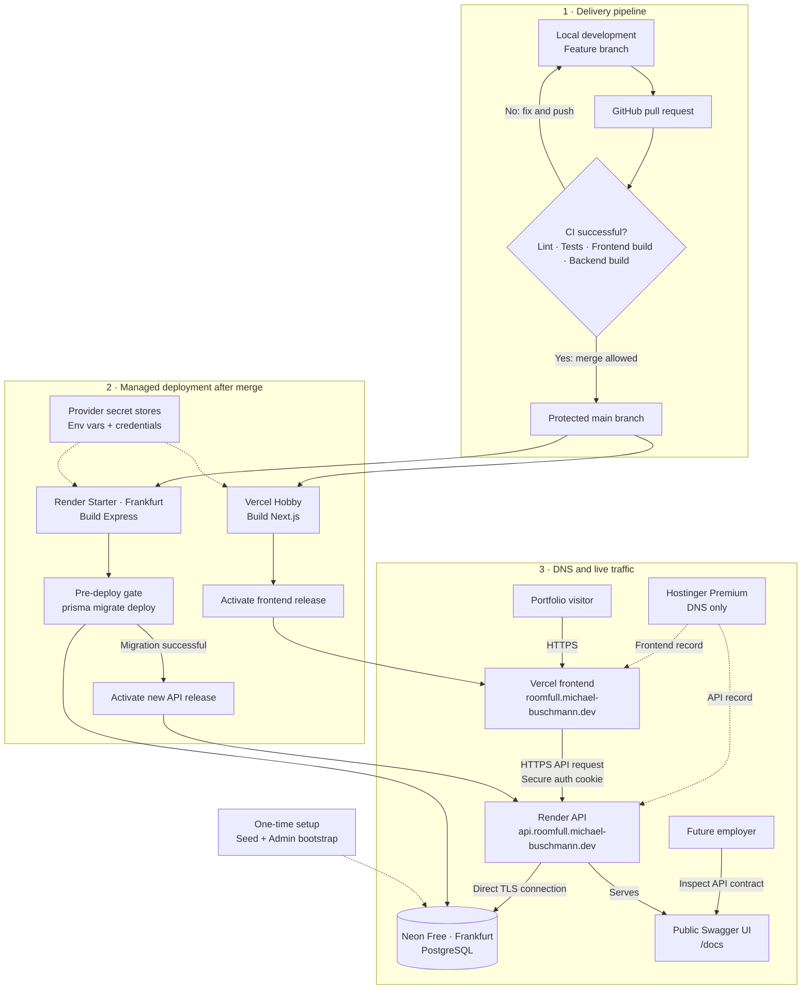

# RoomFull Deployment Plan

Status: agreed target architecture; implementation pending  
Last verified: 2026-06-23

## Goal and scope

Deploy RoomFull as a non-commercial portfolio and learning project without operating a VPS. The deployment should demonstrate a working production setup, CI/CD, secure configuration, database migrations, and observable application health while keeping operational complexity small.

Production data is disposable demo data. RoomFull has no uptime or data-retention promise and must not be presented as a real coworking service. Local development and Production are the only permanent environments; no permanent Staging environment is planned.

## Target architecture

The chart separates repeatable delivery, managed deployment, and live request traffic. Solid arrows are automated or runtime paths; dashed arrows are configuration or one-time setup.



### Service responsibilities

| Concern | Service | Plan / region | Expected cost |
| --- | --- | --- | --- |
| Frontend | Vercel | Hobby; global CDN | $0/month |
| Backend | Render | Starter; Frankfurt | $7/month |
| Database | Neon | Free; AWS Frankfurt | $0/month |
| DNS | Hostinger | existing Premium plan | already paid |

Prices are provider-controlled and must be checked again before provisioning.

### Why this split

- Hostinger Premium does not run Node.js applications and does not provide PostgreSQL.
- Vercel supports the existing dynamic Next.js application without a static-export rewrite.
- Render keeps the Express backend continuously available; Render Free would sleep after inactivity and create a poor first portfolio impression.
- Neon Free provides persistent PostgreSQL without Render Free PostgreSQL's 30-day expiry.
- Render and Neon both use Frankfurt to minimize backend-to-database latency.
- No production Docker setup is needed because all selected services provide managed native runtimes.

Related decision: [ADR 0002 — Managed split deployment](../adr/0002-managed-split-deployment.md).

## Production URLs

| Surface | URL |
| --- | --- |
| Frontend | `https://roomfull.michael-buschmann.dev` |
| API base | `https://api.roomfull.michael-buschmann.dev/api` |
| Health check | `https://api.roomfull.michael-buschmann.dev/health` |
| Swagger UI | `https://api.roomfull.michael-buschmann.dev/docs` |

Swagger stays public as part of the portfolio. It must not contain credentials, tokens, or personal demo data.

## Production data policy

- Production contains demo data only.
- Visitors may register Customer accounts, but the UI must tell them not to enter real personal data or reused passwords.
- The Teams UI must tell visitors to use fictional contact names and email addresses only. Real calendar-invitation tests stay local and use only addresses controlled by the developer.
- Loss of Production data is acceptable. Recovery source is committed Prisma migrations plus an explicit seed.
- `prisma migrate deploy` runs automatically before each backend deployment.
- `prisma db seed` runs only during first installation or an intentional reset.
- A future destructive reset needs its own clearly named command; the normal seed must not silently become a reset.
- The Production Admin is created through a separate idempotent bootstrap command using secrets. No Production Admin password may exist in Git.

## Required pre-deployment hardening

### Cookie-based authentication

Replace the browser-readable JWT in `localStorage` before go-live:

- authentication cookie is `HttpOnly`
- `Secure` is enabled in Production
- `SameSite=Lax`
- cookie remains host-only on the API domain
- frontend API requests use `credentials: "include"`
- backend CORS allows exactly the Production frontend origin and credentials
- login and registration stop returning a browser-stored token
- logout receives an endpoint that clears the cookie
- access session remains valid for one hour
- no refresh-token flow is added to the portfolio MVP

### Abuse protection

Add backend rate limits before opening registration publicly. Cover at least:

- registration
- login
- contact requests
- booking creation and cancellation

The first implementation may use process-local limits because the backend runs as one Render instance. Limits and proxy handling must be tested behind Render before go-live.

### Demo notice

Add visible, localized copy near registration or another unavoidable entry point:

- RoomFull is a portfolio demo, not a real service.
- Do not enter real personal data.
- Do not reuse a real password.
- Demo data may be deleted without notice.

## Production Admin bootstrap

Target command:

```bash
npm run admin:bootstrap
```

Target behavior:

- requires `ADMIN_NAME`, `ADMIN_EMAIL`, and `ADMIN_PASSWORD`
- fails clearly when a required value is absent
- hashes the password with the existing production-strength configuration
- creates the Admin when absent
- updates only the intended Admin account when rerun
- prints no password or password hash
- remains separate from the general demo-data seed

The existing hardcoded Admin seed credentials are a go-live blocker.

## Environment variables and secrets

### Vercel

```env
NEXT_PUBLIC_API_BASE_URL=https://api.roomfull.michael-buschmann.dev/api
```

Only public browser configuration belongs in `NEXT_PUBLIC_*` variables.

### Render runtime

```env
NODE_ENV=production
NODE_VERSION=24
PORT=<provided by Render>
CORS_ORIGIN=https://roomfull.michael-buschmann.dev
DATABASE_URL=<direct Neon PostgreSQL URL with TLS>
JWT_SECRET=<strong random secret>
JWT_EXPIRES_IN=1h
```

Render provides `PORT`; RoomFull must read it and listen publicly on the platform interface. `DATABASE_URL` uses a direct Neon connection initially. A pooled connection and Neon Prisma adapter remain deferred until workload or scaling requires them.

### One-time Admin bootstrap

```env
ADMIN_NAME=<private value>
ADMIN_EMAIL=<private value>
ADMIN_PASSWORD=<strong private value>
```

Store Production secrets only in provider secret stores. Do not put them in `.env.example`, GitHub Actions logs, `render.yaml`, screenshots, or portfolio documentation.

## CI/CD contract

Production changes follow:

```text
feature branch -> pull request -> CI -> merge to protected main -> automatic deploy
```

Direct pushes to `main` should be blocked through GitHub branch protection.

### Required CI checks

Frontend:

```bash
npm ci
npm run lint
npm test
npm run build
```

Backend:

```bash
cd backend
npm ci
npm run prisma:generate
npm run lint
npm test
npm run build
```

CI must not need Production secrets or connect to the Production database.

### Render target configuration

Infrastructure is versioned in a root `render.yaml`. Target values:

```yaml
service: web
runtime: node
rootDir: backend
region: frankfurt
plan: starter
buildCommand: npm ci && npm run prisma:generate && npm run build
preDeployCommand: npm run prisma:migrate:deploy
startCommand: npm start
```

Exact Blueprint syntax must be validated against current Render documentation during implementation. Secret values are marked as externally supplied and never committed.

### Vercel target configuration

- connect the existing GitHub repository
- deploy the repository root as the Next.js application
- use Node.js 24 consistently with local and Render builds
- Production branch is `main`
- set `NEXT_PUBLIC_API_BASE_URL` for Production
- do not connect Preview deployments to Production for mutating tests

## Rollout sequence

### Phase 1 — Application hardening

1. Replace `localStorage` JWT handling with secure cookies.
2. Add logout cookie clearing and update session restoration.
3. Add focused backend rate limits.
4. Add localized portfolio-demo data warning.
5. Add regression tests for auth, CORS credentials, logout, and rate limits.

Exit condition: local frontend and backend complete login, session restore, protected request, and logout without exposing a token to browser JavaScript.

### Phase 2 — Reproducible database setup

1. Remove Production Admin credentials from the general seed.
2. Add idempotent `admin:bootstrap` command.
3. Keep migration, seed, bootstrap, and destructive reset semantics separate.
4. Document local and Production commands.

Exit condition: an empty PostgreSQL database can be migrated, seeded, and given a private Admin without editing source code.

### Phase 3 — CI and deployment configuration

1. Pin Node.js 24 for frontend and backend.
2. Add GitHub Actions checks for both packages.
3. Enable `main` branch protection after CI exists.
4. Add and validate `render.yaml`.
5. Verify the OpenAPI Production server URL strategy.

Exit condition: a failing PR cannot merge; a passing PR produces both frontend and backend builds.

### Phase 4 — Provision database and backend

1. Create Neon Free project in AWS Frankfurt.
2. Store direct Neon connection URL in Render secrets.
3. Create Render Starter service in Frankfurt from `render.yaml`.
4. Apply committed migrations through Render pre-deploy.
5. Run seed once.
6. Run Admin bootstrap once.
7. Verify temporary Render URL before DNS cutover.

Exit condition: temporary Render URL serves `/health`, `/docs`, public API data, auth, and one protected Customer flow.

### Phase 5 — Deploy frontend and connect domains

1. Create Vercel Hobby project from repository root.
2. Set temporary API base URL and verify Vercel deployment.
3. Add `roomfull.michael-buschmann.dev` to Vercel.
4. Add `api.roomfull.michael-buschmann.dev` to Render.
5. Configure required Hostinger DNS records from provider instructions.
6. Set final frontend API URL and backend CORS origin.
7. Wait for managed TLS certificates and verify HTTPS.

Exit condition: both final domains work over HTTPS and browser CORS requests succeed only from the intended frontend.

### Phase 6 — Production smoke test and handoff

Run the smoke-test checklist below, inspect provider logs, then add live frontend and Swagger links to README/portfolio material.

## Production smoke-test checklist

### Infrastructure

- [ ] Frontend domain returns HTTPS without certificate warnings
- [ ] API domain returns HTTPS without certificate warnings
- [ ] `/health` returns `200` and `{ "ok": true }`
- [ ] `/docs` renders Swagger UI
- [ ] HTTP redirects to HTTPS
- [ ] Render and Neon show Frankfurt region

### Public and Customer flows

- [ ] German and English localized routes work
- [ ] Public booking options and unit details load
- [ ] Registration shows demo-data warning
- [ ] Registration succeeds without exposing JWT in response storage
- [ ] Login creates secure HttpOnly cookie
- [ ] Page reload restores session
- [ ] Availability request works
- [ ] Booking creation succeeds
- [ ] Own booking cancellation succeeds
- [ ] Contact request succeeds
- [ ] Logout clears session

### Security and failure behavior

- [ ] Browser `localStorage` contains no auth token
- [ ] Cookie flags are correct in Production
- [ ] Request from an unapproved Origin is rejected
- [ ] Auth and mutation rate limits return controlled `429` responses
- [ ] Missing/invalid auth returns expected `401`
- [ ] Customer access to Admin endpoints returns expected `403`
- [ ] Logs contain no passwords, JWTs, database URLs, or cookie contents

### Admin flow

- [ ] Private Production Admin can log in
- [ ] Admin dashboard loads
- [ ] Admin unit create/update/deactivate flow works
- [ ] Admin bookings and contact inbox load
- [ ] Public documentation contains no Admin credentials

### Deployment behavior

- [ ] Pull request CI blocks a deliberately failing check
- [ ] Merge to `main` triggers Vercel and Render deployments
- [ ] Render runs `prisma migrate deploy` before activation
- [ ] Seed does not run during normal deployments
- [ ] Failed deployment keeps previous healthy version available or can be rolled back

## Observability

Initial monitoring stays intentionally small:

- Render application and deploy logs
- Vercel build and runtime logs
- Neon usage and connection metrics
- public backend `/health` endpoint

No Sentry or custom monitoring dashboard is planned for initial deployment. A simple external uptime check may be added later.

## Deferred work

### n8n and synthetic traffic

Synthetic traffic is a separate post-deployment slice. It must not block or complicate initial go-live.

Before implementation, decide:

- hosted n8n versus another managed scheduler; no self-hosted VPS by default
- dedicated synthetic Customer identities
- deterministic rate and maximum data volume
- tagging or naming that keeps synthetic activity recognizable
- cleanup/retention policy
- prohibition on Production Admin credentials in workflows
- behavior when rate limits or API errors occur

Synthetic traffic may register Customers, create or cancel Bookings, and create Contact Requests only after the normal Production flows are stable and observable.

### Explicitly not planned now

- production Docker setup
- self-managed VPS
- permanent Staging environment
- refresh tokens
- high availability or multi-region deployment
- paid database backups
- Sentry or custom monitoring platform
- automatic recurring demo-data reset

## Provider references

- [Hostinger Node.js Web Apps plan support](https://www.hostinger.com/support/?p=6553)
- [Hostinger hosting plan limits](https://www.hostinger.com/support/6976044-parameters-and-limits-of-hosting-plans-in-hostinger)
- [Hostinger PostgreSQL support](https://support.hostinger.com/en/articles/1583659-is-postgresql-supported-at-hostinger)
- [Vercel Hobby plan](https://vercel.com/docs/plans/hobby)
- [Render pricing](https://render.com/pricing)
- [Render regions](https://render.com/docs/regions)
- [Render Blueprint specification](https://render.com/docs/blueprint-spec)
- [Neon pricing](https://neon.com/pricing)
- [Neon regions](https://neon.com/docs/conceptual-guides/regions)
- [Prisma with Neon](https://docs.prisma.io/docs/v6/orm/overview/databases/neon)
